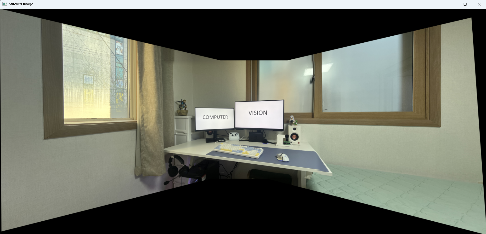

# Image Seamless Stitcher

This project stitches three images into one seamless panorama-like result using OpenCV and NumPy.

## Example Result



## Overview

This pipeline works as follows:

1. Reads `data/image01.jpg`, `data/image02.jpg`, and `data/image03.jpg`.
2. Estimates homographies to align left/right images to the center image (`image02`).
3. Blends overlapping areas with feather blending for smoother transitions.
4. Preserves center-image sharpness while softly blending near boundaries.
5. Saves the result as `data/stitched_result.jpg` and shows a preview window.

## Project Structure

```text
Image_Seamless_Stitcher/
├─ image_seamless_stitcher.py
├─ data/
│  ├─ image01.jpg
│  ├─ image02.jpg
│  ├─ image03.jpg
│  └─ stitched_result.jpg   # generated after running
└─ screenshot.png           # example output image used in this README
```

## Requirements

- Python 3.9+
- numpy
- opencv-python

Install:

```bash
pip install numpy opencv-python
```

## How To Run

Run from the project root:

```bash
python image_seamless_stitcher.py
```

On success, the script prints the output path and opens an OpenCV window showing the stitched result.

## Input / Output

- Input:
  - `data/image01.jpg` (right image)
  - `data/image02.jpg` (center reference image)
  - `data/image03.jpg` (left image)
- Output:
  - `data/stitched_result.jpg`

## Notes

- The script uses relative paths (`data/...`), so run it from the project root.
- Press any key while the OpenCV window is focused to close it.
- If you get `Not enough good matches`, try images with richer texture and overlap.
